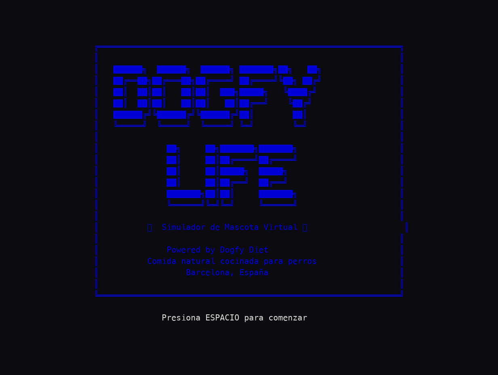
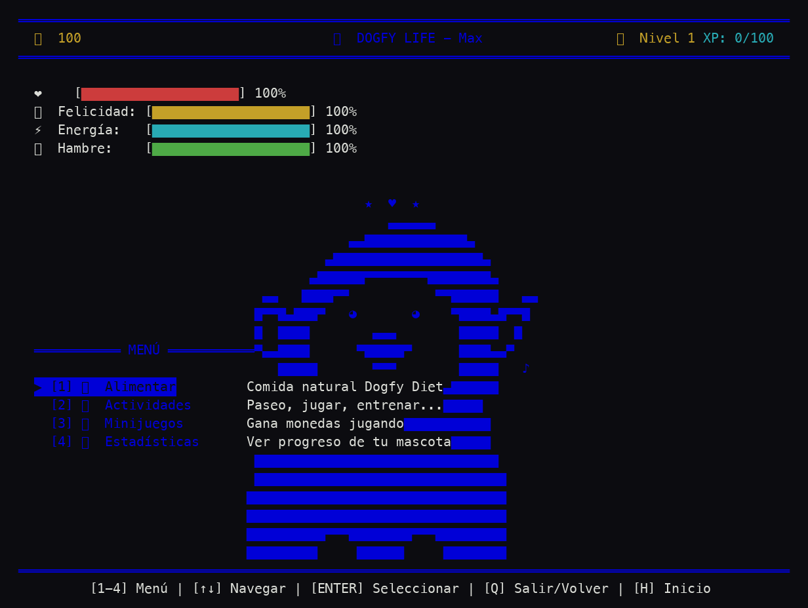

<div align="center">



# 🐕 Dogfy Life

**Tu mascota virtual en la terminal: aliméntala, juega con ella y mírala crecer.**


</div>

---

## 🐕 Qué es esto

Dogfy Life es un simulador de mascota virtual al estilo Tamagotchi protagonizado por un Golden Retriever en arte ASCII. Cuidas de tu perro vigilando sus barras de salud, felicidad, energía y hambre, y respondes a sus necesidades con comida natural, paseos, juegos y caricias. El perro se anima según su estado de ánimo: feliz, comiendo, durmiendo, triste, paseando o jugando.

Hay menús de comida, actividades, minijuegos y estadísticas, además de dos minijuegos integrados —atrapar premios ("catch") y memoria ("memory")— para ganar monedas. Tu progreso se guarda en `dogfy_save.json`, así que tu mascota sigue ahí cuando vuelves. Temática de Dogfy Diet, comida natural cocinada para perros.

## 🎮 Cómo se juega

| Tecla | Acción |
|---|---|
| `↑` `↓` / `W` `S` | Navegar opciones |
| `←` `→` / `A` `D` | Mover en el minijuego de atrapar |
| `Enter` / `Espacio` | Confirmar |
| `1` `2` `3` `4` | Acciones rápidas / menús |
| `H` | Ayuda |
| `Q` / `Esc` | Salir / volver |

## 🚀 Cómo ejecutar

```bash
git clone https://github.com/gavilanbe/dogfy-life.git
cd dogfy-life
python3 dogfy_life.py
```

Requiere Python 3.8+ y una terminal con soporte Unicode.

## 📸 Captura



## 🛠️ Bajo el capó

- Python 3.8+ con la librería estándar `curses` (sin dependencias externas).
- Arte ASCII y animaciones del perro por frames según su estado de ánimo.
- Guardado y carga de progreso en `dogfy_save.json`.
- Minijuegos integrados (catch y memory) y sistema de niveles/experiencia.

## 📦 Créditos

Parte de mi colección de juegos. Publicado por [**@gavilanbe**](https://github.com/gavilanbe).

## 📄 Licencia

[MIT](LICENSE)
